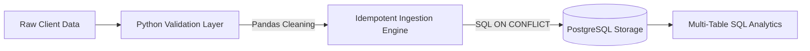

# Enterprise Data Sanitation & Relational Analytics Pipeline

An automated data engineering pipeline designed to handle messy, unverified enterprise transaction records. The system utilizes **Python** and **Pandas** as an isolated data hygiene layer to strip out critical anomalies before safely streaming clean production vectors into a relational **PostgreSQL** storage tier using idempotent UPSERT architecture.

## 🏗️ System Architecture & Data Flow



## 🛠️ Tech Stack & Dependencies
* **Core Language:** Python 3.11+
* **Data Processing:** Pandas (Dataframe parsing & structural constraints enforcement)
* **Database Engine:** PostgreSQL Server (Relational storage, integrity checks, indexed search queries)
* **Database Driver:** Psycopg2-binary (Safe transaction connection driver)
* **Configuration Protection:** Python-dotenv (Segregating security credentials from public view)

## 🧼 Core Data Hygiene & Validation Controls
To preserve production database integrity, the validation layer enforces the following strict data filters:
1. **Identity Integrity Checks:** Drops rows containing null properties or missing `customer_id` tracking fields.
2. **Pricing Anomaly Guardrails:** Filters out corrupt ledger inputs displaying negative numerical prices (`price >= 0`).
3. **Temporal Ingestion Balancing:** Dynamically replaces missing data timestamps with normalized real-time ISO dates.
4. **Feature Engineering Automation:** Programmatically computes the final customer billing fields (`quantity * price`) at the ingestion layer.

## 🚀 Local Installation & Execution Guide

### 1. Clone the Workspace and Set Up Isolation
```bash
# Clone the workspace and enter directory
cd messyclient

# Initialize isolated Python environment
python -m venv env
source env/bin/activate  # On Windows use: .\env\Scripts\activate
```

### 2. Configure Local Environment Variables
Create a `.env` configuration file in the project root directory using the template layout below:
```env
DB_HOST=localhost
DB_NAME=fde_retail_db
DB_USER=postgres
DB_PASSWORD=your_secure_password
DB_PORT=5432
```

### 3. Build the Database Schema Structures
Execute the structural blueprints located inside `schema.sql` inside your active PostgreSQL tool interface to initialize the structural tables:
* `customers` table (Profile master table)
* `products` table (Inventory specifications)
* `orders` table (Transactional ledger referencing structural foreign keys)

### 4. Trigger Ingestion Script Execution
```bash
python pipeline.py
```

## 📊 Business Intelligence Metrics (SQL Aggregations)
The architecture includes multi-table relational join configurations and window calculations to output real-time core metrics:

```sql
-- Executive Summary Aggregation
SELECT 
    COUNT(order_id) AS total_orders,
    SUM(quantity) AS total_units_sold,
    SUM(total_amount) AS gross_revenue
FROM orders;
```

### Output Metric Grid Matrix Verified Result:
```text
 total_orders | total_units_sold | gross_revenue 
--------------+------------------+---------------
            3 |                5 |        570.00
(1 row)
```
